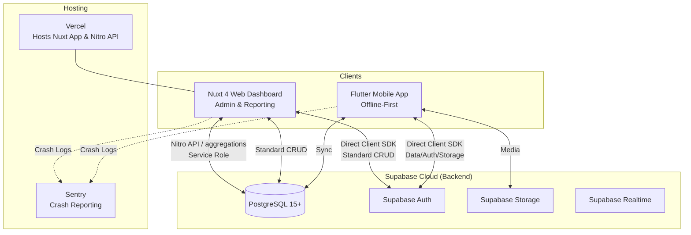
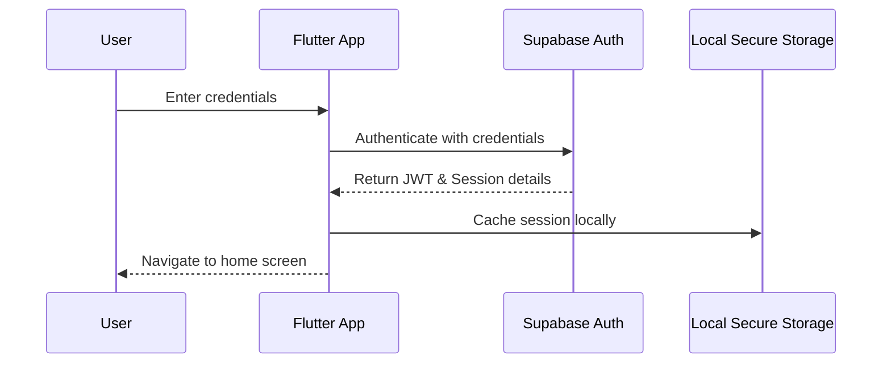
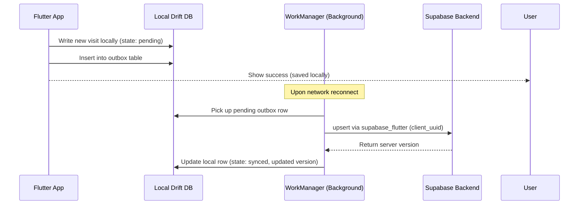
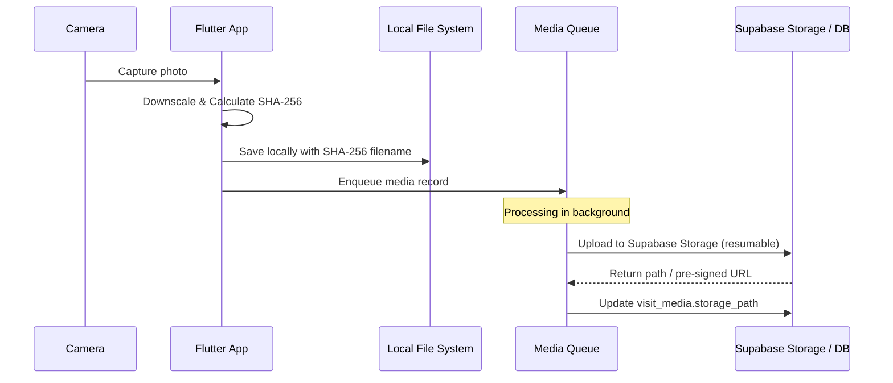
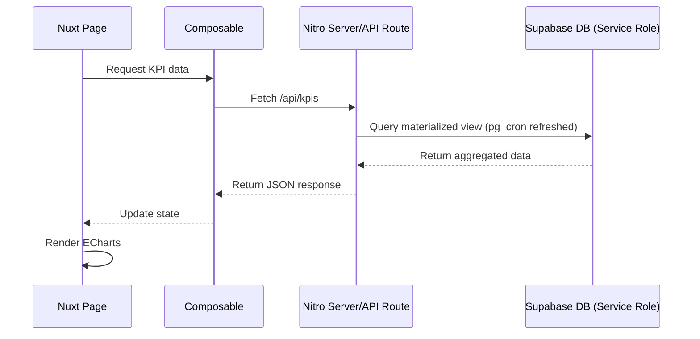

# System Architecture

## 1. High-Level Architecture

---

## 2. Data Flow Diagrams

### 2.1 Login Flow

### 2.2 Create Visit (Offline-First) Flow

### 2.3 Media Upload Flow

### 2.4 Dashboard KPIs Flow

---

## 3. Offline-First Design Principles

1. **Every write lands in local Drift first:** NEVER write directly to the network from the UI. This ensures immediate responsiveness and consistent behavior regardless of network status.
2. **Every read is a Stream from Drift:** Riverpod providers strictly watch local database streams. The UI is a pure reflection of the local SQLite state.
3. **Network is an enhancement, not a dependency:** The app must be fully functional for core workflows without any network connection.
4. **Transparent Sync Status:** Syncing runs in the background via WorkManager. The UI must always display the per-record sync status (e.g., cloud icon with a checkmark or a warning indicator).

---

## 4. Sync State Machine

Every synchronizable entity follows this state machine:

- `draft`: Record is incomplete or deliberately kept local by the user. Not queued for sync.
- `pending`: Record is complete and ready. Queued in the outbox.
- `syncing`: WorkManager has picked up the record and an active network request is in flight.
- `synced`: Server has confirmed receipt and returned the authoritative server version.
- `failed`: Terminal failure state (e.g., max retries exceeded or validation error). Needs user or admin intervention.

*Transitions:*
`draft` → `pending` → `syncing` → `synced`
`syncing` → `pending` (transient network error, backoff applied)
`syncing` → `failed` (permanent error, e.g., max retries or 400 Bad Request)

---

## 5. Conflict Resolution

We use a **"Server Wins on Version Mismatch"** strategy.

- **Idempotency:** Every client record is assigned a client-generated UUID (`client_uuid`). The PostgreSQL database enforces a `UNIQUE` index on this ID.
- **Delta Sync:** When syncing, the client provides its local `version`. If the server `version` is greater than the local one (meaning another client updated the record), the server update overwrites the local state.
- **Logging conflicts:** If the client attempts to write and a version conflict occurs, the server rejects it. The client logs the conflict to a `sync_log` table for admin review and marks the local record as `failed` to prevent infinite loops.

---

## 6. Retry Policy

For background sync tasks, WorkManager implements an **exponential backoff** strategy to handle transient network issues gently without overwhelming the server.

- **Intervals:** 30s, 60s, 2m, 4m, 8m, 16m, 32m, capped at 1h.
- **Max Attempts:** 10 attempts.
- **Failure:** After 10 failed attempts, the record's sync state transitions to `failed`. The user is notified via in-app UI to take action or review.

---

## 7. Media Strategy

- **Content-Addressed Filenames:** All media files are named using their SHA-256 hash. This natively deduplicates files and ensures integrity.
- **Separate Queue:** Media files are large and fail often. They use a dedicated upload queue separate from lightweight JSON records. A record syncs first, and its media uploads asynchronously.
- **Resumable Uploads:** Use Supabase Storage TUS protocol for resumable uploads to handle spotty connections in the field.
- **Cleanup Policy:** A background worker on the client periodically clears orphaned local media (files older than 30 days that are confirmed synced).

---

## 8. Multi-Language Strategy

The application uses a **Two-Tier** localization architecture:

### Tier 1: App-Shell Strings (Static)
- **Scope:** Button labels, navigation elements, static error messages, generic UI text.
- **Implementation:** Shipped within the app bundles.
- **Mobile:** Flutter ARB files (`shared/i18n/`).
- **Web:** Nuxt i18n JSON files (`shared/i18n/`).

### Tier 2: Entity Translations (Dynamic)
- **Scope:** Database entities like Country names, Tree Species, Activities.
- **Implementation:** A centralized `translations` table in PostgreSQL.
- **Workflow:** Admins edit these at runtime via the web dashboard. The mobile app caches this table locally during its initial metadata sync.

---

## 9. Security Model Overview

- **Authentication:** Supabase Auth manages identities and issues JWTs.
- **Row Level Security (RLS):** Postgres RLS policies strictly enforce data access based on the user's role and assigned countries (extracted directly from the JWT claims or `profiles` table). Users cannot query data outside their assigned domain.
- **Service Role:** The `service_role` key bypasses RLS. It is NEVER shipped to the client and is only used securely within the Nuxt Nitro server APIs for backend-only operations (e.g., aggregations) with manual authorization checks applied.

---

## 10. Role Definitions

| Role | Responsibilities & Access |
|------|---------------------------|
| **super_admin** | Full read/write access across all countries and system settings. |
| **admin** | Manage users, master data, and view operations exclusively for their assigned countries. |
| **coordinator** | Schedule and supervise field visits within assigned countries. Can re-assign tasks. |
| **field_user** | Create and view their own visits. Cannot see data from other field users. |
| **viewer** | Read-only access to dashboard KPIs and aggregate reports for assigned countries. |

---

## 11. Scaling Plan (300 → 10,000 users)

To support rapid scale, the system relies on the following performance optimizations:

- **Indexing:**
  - `(country_id, visit_date)` for fast filtering by coordinators.
  - `(created_by, status)` for field user queries.
  - `(updated_at)` for fast, reliable delta sync pulls.
- **Materialized Views:** Dashboard KPIs (which scan millions of rows) run against materialized views refreshed every 5 minutes via `pg_cron`, preventing complex queries from hammering the active operational tables.
- **Cursor-Based Pagination:** Adopted universally across web list views and mobile delta sync to prevent offset-based performance degradation on large tables.
- **Infrastructure Upgrade Path:**
  - Start on **Supabase Free** for development.
  - Upgrade to **Supabase Pro ($25/mo)** for production launch.
  - Upgrade to **Supabase Team/Enterprise** or allocate dedicated compute as concurrency requirements grow beyond initial projections.
